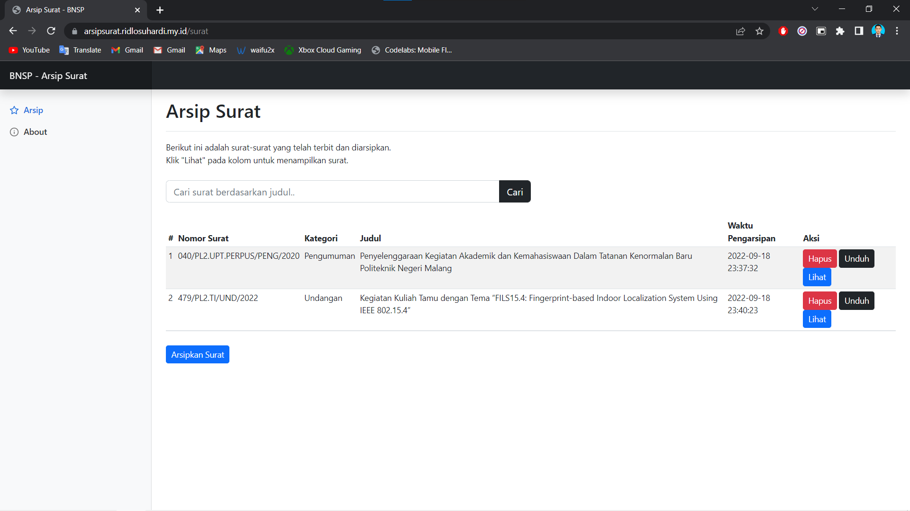
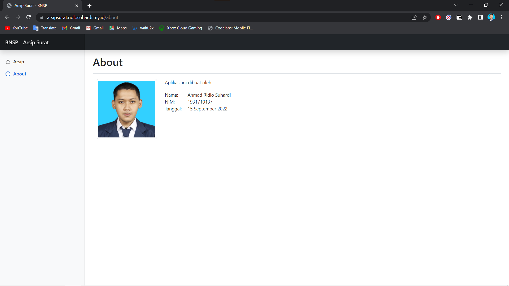

# Arsip Surat

Program aplikasi arsip surat untuk sertifikasi DIKSI tahun 2022.
Dibangun menggunakan bahasa pemrogrmaman PHP dengan framework Code Igniter versi 3

## Teknologi yang digunakan

- Code Igniter 3
- MySQL

## Contoh Program

Demo aplikasi bisa dilihat disini:

<a href="https://arsipsurat.ridlosuhardi.my.id/" target="_blank">Demo Aplikasi Arsip Surat</a>
